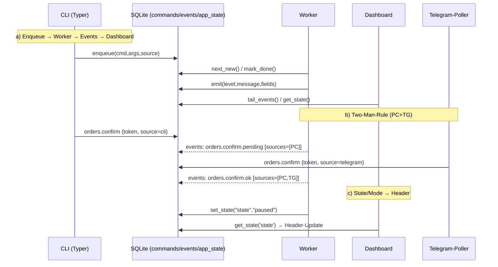

# MarketLab – Architektur

TL;DR
- Zweck: Einfache, skriptbare Trading-Umgebung mit klaren Modi (backtest/replay/paper/live) und einheitlicher Steuerung.
- Hauptprozesse: Typer-CLI, statischer Supervisor, Telegram-Poller, Worker-Daemon, read-only Dashboard.
- IPC über SQLite („Command-Bus“): Tabellen `commands`, `events`, `app_state` unter `IPC_DB` (Standard `runtime/ctl.db`).
- Status: Telegram integriert (Real/Mock), IBKR-Adapter als Stub mit Delayed-Marktdatenmodus.
- Konfiguration zentral via `get_settings()` aus `.env` (keine direkten `os.environ`).

Systemübersicht
```mermaid
flowchart LR
  subgraph CLI[Typer-CLI]
    A1[marketlab cli.py]\ncommands, modes
  end
  subgraph SUP[Supervisor]
    S1[supervisor.py]\nStart/Stop/Health
  end
  subgraph TG[Telegram]
    T1[tools/tg_poller.py]\nAllowlist+Buttons
  end
  subgraph BUS[Command-Bus (SQLite)]
    B1[(commands)]
    B2[(events)]
    B3[(app_state)]
  end
  subgraph W[Worker]
    W1[daemon/worker.py]\nTwo-man, TTL, Events
  end
  subgraph UI[Dashboard]
    D1[tools/tui_dashboard.py]\nRead-only Panels
  end
  subgraph ORD[Orders/Store]
    O1[orders/store.py]\nJSON Index
  end
  subgraph DATA[Data Adapters]
    DA1[data/adapters.py]\nCSV/Parquet, IBKR Stub
  end
  subgraph CORE[App-State]
    C1[ipc/bus.py]\nset_state/get_state
  end

  CLI -->|ctl.enqueue| BUS
  SUP -->|spawn & ctl| BUS
  TG  -->|/commands & buttons| BUS
  W   -->|consume NEW| BUS
  W   -->|emit| B2
  W   -->|set_state| B3
  UI  -->|tail_agg + state| BUS
  DATA --> W
  ORD  --> UI
  CLI --> DATA
```

Kernkomponenten
- IPC-Bus: `src/marketlab/ipc/bus.py`
  - Tabellen: `commands(status: NEW|DONE|ERROR, available_at, ttl_sec, dedupe_key)`, `events(level, message, fields)`, `app_state(key,value,updated_at)`.
  - API (Auszug):
    - `enqueue(cmd: str, args: dict, source: str, ttl_sec=300, dedupe_key=None) -> str`
    - `next_new() -> Optional[Command]`, `mark_done(cmd_id)`, `mark_error(cmd_id, err, retry_backoff_sec)`
    - `emit(level, message, **fields)`, `set_state(key, value)`, `get_state(key, default="")`, `tail_events(limit)`
- Worker-Daemon: `src/marketlab/daemon/worker.py`
  - Verarbeitet `NEW`-Commands; emittiert Events wie `state.changed`, `orders.confirm.*`.
  - Two-Man-Rule: `orders.confirm` benötigt zwei unterschiedliche `source` (z. B. `cli` + `telegram`) innerhalb TTL.
  - TTL/Approvals in-memory; Events: `orders.confirm.pending` → `orders.confirm.ok` inkl. `sources=[...]`.
  - Aktualisiert `app_state` (z. B. `state=paused|running`, `mode=...`, `worker_start_ts`).
- Dashboard: `tools/tui_dashboard.py`
  - Panels: Header (Mode/State/Uptime/DB/PID), Orders (Top 20), KPIs (events/min, cmd-counts, TTL), Conn (IBKR/Telegram), Events (aggregiert).
  - Refresh: adaptiv über `EVENTS_REFRESH_SEC`/`KPIS_REFRESH_SEC` und Event-Tail-Änderungen.
  - Read-only: keine Eingabe, `screen=False`.
- Supervisor (statisches Menü): `src/marketlab/supervisor.py`
  - Befehle: Start/Stop/Restart ALL, Confirm/Reject per Token/Index, Mode Paper/Live, Pause/Resume, Tail Events, Health.
  - `[r]` Refresh aktualisiert Statuszeile (QueueDepth, Health, PIDs) ohne Live-UI.
- Control-Menu (stdin): `src/marketlab/control_menu.py`
  - Nummernauswahl; Pending-Liste paginiert; Auswahl per Zahl oder Token; keine Kopf-Wiederholung.
  - Enqueue: `orders.confirm|reject`, `state.pause|resume|stop`, `mode.switch`.
- Telegram-Poller: `tools/tg_poller.py`
  - Base: `https://api.telegram.org/bot<TOKEN>/` (GET/POST via stdlib).
  - Allowlist: `TG_ALLOWLIST` (CSV-IDs), Gruppen als negative IDs; Commands `/pause` `/resume` `/paper` `/live` `/confirm <TOKEN>` `/reject <TOKEN>`.
  - Buttons: `services/telegram_usecases.py::build_main_menu()`; Callbacks → `handle_callback()` → `enqueue(source="telegram")`.
- Settings-Layer
  - `src/marketlab/settings.py::get_settings()` (Singleton via pydantic-settings, `.env` UTF-8).
  - Optionaler Bootstrap: `src/marketlab/bootstrap/env.py::load_env(mirror=True)` (spiegelt Schlüssel in `os.environ`).
- Data
  - Bars: CSV/Parquet; Namensschema `SYMBOL_TIMEFRAME.{csv,parquet}`; Adapter `CSVAdapter`.
  - IBKR-Stub `IBKRAdapter`: setzt Delayed-Daten via `reqMarketDataType(3)`; `ping()`, `capabilities()`; optionale `submit_order()` Simulation.

Laufzeit-Flows


Datenmodelle & Formate
- Command-Bus (SQLite):
  - `commands(id, cmd_id, cmd, args(JSON), source, status, dedupe_key, retry_count, available_at, ttl_sec)`
  - `events(id, ts, level, message, fields(JSON))`
  - `app_state(key PRIMARY KEY, value TEXT, updated_at TEXT)`
- Orders/Store: `runtime/orders/state.json` (Index) + `orders.jsonl` (Events)
  - Ticket-Felder: `id, token, symbol, side, qty, type, state, created_at, expires_at`.
- Marktdaten-Dateien (Bars):
  - Pfad: `data/`; Schema `SYMBOL_TIMEFRAME.{csv,parquet}` (z. B. `AAPL_15m.parquet`).
  - Spalten: `time, open, high, low, close, volume`.

Konfiguration (.env)
- Pflicht
  - `IPC_DB` (z. B. `runtime/ctl.db`)
  - `TELEGRAM_ENABLED` (`0|1`)
  - `TELEGRAM_BOT_TOKEN` (Format `123456:...`)
  - `TG_CHAT_CONTROL` (int; Gruppen negativ: `-100…`)
  - `TG_ALLOWLIST` (CSV von int)
- Optional
  - `TELEGRAM_MOCK`, `TELEGRAM_TIMEOUT_SEC`, `TELEGRAM_LONG_POLL_SEC`, `TELEGRAM_DEBUG`
  - `EVENTS_REFRESH_SEC`, `KPIS_REFRESH_SEC`, `DASHBOARD_WARN_ONLY`
  - `IBKR_ENABLED`, `TWS_HOST`, `TWS_PORT`, `IBKR_CLIENT_ID`
- Regeln
  - `.env` in Projekt-Root, UTF-8, Zeilenform `KEY=VALUE` (keine Inline-Kommentare).
  - Gruppen-IDs in Telegram sind negativ; Allowlist als CSV.

Runbooks (Windows, DEV)
- Start ALL (Supervisor)
  - `python -m marketlab supervisor`
- Einzelprozesse
  - Worker: `python -c "from src.marketlab.daemon.worker import run_forever; run_forever()"`
  - Dashboard: `python -m tools.tui_dashboard`
  - Telegram-Poller: `python -m tools.tg_poller`
- Health/Diag
  - Enqueue: `python -m marketlab ctl enqueue --cmd state.pause --args "{}"`
  - Events-Tail (Supervisor Menü: Option 12)
  - Telegram-Diag: `python tools/tg_diag.py getme`

Qualitätsmerkmale
- Dashboard: keine Live-Eingabe; `screen=False`; stabile Kopf-/Panel-Aufteilung.
- Worker-Commands: idempotente Verarbeitung; Dedupe via `dedupe_key`; TTL-Fenster für Approvals.
- Logging: stdout JSON (`utils/logging.py`); Bus-Events in SQLite; Mock-Artefakte unter `runtime/telegram_mock/`.
- Settings: ausschließlich über `get_settings()`/`load_env()`; keine direkten `os.environ`-Zugriffe in Kernpfaden.

Roadmap (kurz)
- IBKR: echte Connectivity (Reconnect, Fehlerpfade), Orders/Fills.
- Orders: Persistenz & Reports, Token-Flow härten, Ablauf (TTL) serverseitig durchsetzen.
- Observability: konsolidierte Metriken/Reports.

Code/SQL-Skizzen
```sql
-- commands/events/app_state (vereinfacht)
CREATE TABLE IF NOT EXISTS commands (
  id INTEGER PRIMARY KEY AUTOINCREMENT,
  cmd_id TEXT UNIQUE,
  cmd TEXT NOT NULL,
  args TEXT NOT NULL,
  source TEXT,
  status TEXT NOT NULL DEFAULT 'NEW',
  dedupe_key TEXT,
  retry_count INTEGER NOT NULL DEFAULT 0,
  available_at INTEGER NOT NULL DEFAULT (strftime('%s','now')),
  ttl_sec INTEGER
);
CREATE TABLE IF NOT EXISTS app_state (
  key TEXT PRIMARY KEY,
  value TEXT NOT NULL,
  updated_at TEXT NOT NULL
);
CREATE TABLE IF NOT EXISTS events (
  id INTEGER PRIMARY KEY AUTOINCREMENT,
  ts INTEGER NOT NULL DEFAULT (strftime('%s','now')),
  level TEXT NOT NULL,
  message TEXT NOT NULL,
  fields TEXT
);
```

Mini-Python (Signaturen)
```python
from src.marketlab.ipc import bus
cmd_id = bus.enqueue("state.pause", {}, source="cli", ttl_sec=300)
c = bus.next_new(); bus.mark_done(c.cmd_id)
bus.emit("ok", "orders.confirm.ok", token="ABC123", sources=["cli","telegram"]) 
```

Beispiel-Eventlabels
- „Order bestätigt ABC123 [PC+TG]“ (intern: `orders.confirm.ok`, `sources=["cli","telegram"]`).
- „Order ausstehend ABC123 [PC]“ (intern: `orders.confirm.pending`).
- „State geändert → paused“ (intern: `state.changed`, `state=PAUSED`).

