# Architektur

```mermaid
flowchart TD
  CLI[Typer CLI (python -m marketlab)] --> Init[Init: Logging, Settings, Signals, TG-Poller]
  Init --> Modes[Modes: backtest / replay / paper / live / control]
  Modes --> State[Global State Manager]
  Modes --> Services[Services: TelegramService]
  Services --> EXT[(Telegram API / Mock JSON)]
  Modes --> Data[Data Adapters]
  Logs[(stdout JSON, runtime/telegram_mock, reports/events)] --> Observability
```

## Komponenten

- CLI (Typer)
  - Datei: `src/marketlab/cli.py`, Einstieg: `src/marketlab/__main__.py` → `app()`
  - Kommandos: `control`, `backtest`, `replay`, `paper`, `live`
  - Callback init: `utils/logging.setup_logging`, `settings` laden, `utils/signal_handlers.register_signal_handlers`, `telegram_service.start_poller()`

- State Manager
  - Datei: `core/state_manager.py` – `STATE` (Singleton), `RunState`, `Command`
  - Funktionen: `set_mode`, `set_state`, `post`, `get_nowait`, `should_stop`, `snapshot`

- Services – Telegram
  - Datei: `services/telegram_service.py`
  - Real/Mock: `_is_mock()` schaltet Ausgaben auf `runtime/telegram_mock/*.json` um
  - API: `notify_start|notify_end|notify_error`, `start_poller/stop_poller`, Inline-Menu `/menu, /status, /pause, /resume, /stop`
  - Globale Instanz: `telegram_service`

- Modes
  - `modes/backtest.py`: lädt Bars (CSV/Parquet) via `CSVAdapter`, Fortschritt via `STATE`
  - `modes/replay.py`: Vorlade-/Run-Meldungen, kein Loop
  - `modes/paper.py`, `modes/live.py`: Stub-Streams via `IBKRAdapter`
  - `modes/control.py`: Idle-Schleife; einmaliger Telegram-Start-Ping bei Eintritt

- Data Adapters
  - Datei: `data/adapters.py`: `CSVAdapter` (Parquet/CSV), `IBKRAdapter` (Stub)
  - Pfade: `data/paths.py` → `bars_path()`

- Logging
  - Datei: `utils/logging.py` – JSON-Formatter auf stdout
  - Observability-Verzeichnisse: `runtime/telegram_mock/`, `reports/events/`

- Signal-Handling
  - Datei: `utils/signal_handlers.py` – SIGINT/SIGTERM → `RunState.EXIT`

- Legacy/Kompatibilität
  - `main.py` (argparse-Menü, nutzt `shared/`-Layer), `shared/system/telegram_notifier.py` (Legacy-Routing + Events)

## Laufzeit-Flows

### Mode-Run (Backtest/Replay/Paper/Live)


### Control-Loop

```mermaid
sequenceDiagram
  participant U as User
  participant CLI as Typer CLI (control)
  participant TG as TelegramService
  participant CT as control.run
  participant ST as STATE
  U->>CLI: python -m marketlab control
  CLI->>CLI: init (Logging/Settings/Signals)
  CLI->>TG: start_poller()
  CLI->>CT: run()
  CT->>ST: set_mode("control"), set_state(RUN)
  CT->>TG: send("🟢 Control-Loop gestartet") (einmalig)
  CT-->>CT: while not STATE.should_stop(): sleep
```



## CLI – Kommandos und Beispiele (PowerShell)

- Hilfe: `python -m marketlab --help`
- Control: `python -m marketlab control`
- Backtest: `python -m marketlab backtest --profile default --symbols AAPL,MSFT --timeframe 15m`
- Replay: `python -m marketlab replay --profile default --symbols AAPL --timeframe 1h`
- Paper: `python -m marketlab paper --profile default --symbols AAPL --timeframe 1m`
- Live: `python -m marketlab live --profile default --symbols AAPL --timeframe 1m`

## Telegram – Real vs. Mock

- ENV-Schalter
  - `TELEGRAM_ENABLED=true|false`
  - `TELEGRAM_BOT_TOKEN`, `TG_CHAT_CONTROL`, optional `TG_ALLOWLIST`
  - `TELEGRAM_MOCK=1` → Mock-Dateien unter `runtime/telegram_mock/`
- Werkzeuge (Mock)
  - `python tools/tg_cli.py` – Interaktive Mock-CLI
  - `python tools/tg_dashboard.py` – Tastatur-Dashboard
  - `python tools/mock_roundtrip.py` – Minimaler Roundtrip-Test
  - Diagnose: `python tools/tg_diag.py`

## Environment/Settings

- `src/marketlab/settings.py` (pydantic-settings)
  - `TelegramSettings`: `enabled`, `bot_token`, `chat_control`, `allowlist_csv`, `mock`
  - `AppSettings`: `env_mode`, `app_brand`, `ibkr`, `telegram`
- `.env` Beispielwerte vorhanden (siehe Repo-Root)

## Tests

- `pytest -q`
- `tests/test_cli_smoke.py`: Hilfe-Text + Backtest-Smoke (stdout enthält `backtest.start`).

## Betrieb & Artefakte

- Logging: stdout (JSON). Keine Dateirotation konfiguriert (TODO bei Bedarf).
- Mock-Ausgaben: `runtime/telegram_mock/*.json` (letzte gesendete Nachrichten, inkl. Inline-Keyboard).
- Legacy-Events: `reports/events/startup.json`.

## Roadmap / TODO

- IBKRAdapter: echte Verbindung/Streams, Fehlerpfade, Reconnect.
- Orders/Execution für `paper`/`live` inkl. Telegram-Steuerung.
- Daten-ETL und Validierungspfade.
- Einheitliche Observability (Dateilogs/Reports) und Metriken.
- Migration `main.py`-Features in Typer-CLI oder Entfernung des Legacy-Shims.

