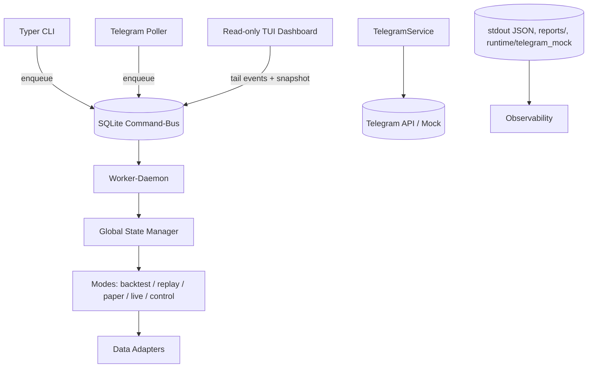

# Architektur – Stand aktuell

## High-Level

- Zwei Prozesse, klare Rollen.
  - Steuer-CLI: Bedienung, keine Live-Ausgabe.
  - Read-only TUI Dashboard: Anzeige, keine Eingabe. Rich Live ohne Flackern.
- Gemeinsamer Command-Bus über SQLite: `runtime/ctl.db`.
- Worker-Daemon zieht Kommandos, setzt Policies (TTL, Two-Man-Rule).
- Telegram sendet nur über den Bus. Kein Direktzugriff auf STATE.
- IBKR: nach `connect` immer `reqMarketDataType(3)` für Delayed-Fallback.

## Komponenten

- IPC-Bus (`src/marketlab/ipc/bus.py`)
  - SQLite mit WAL.
  - Funktionen: `bus_init`, `enqueue(cmd, args, source)`, `next_new`, `mark_done`, `mark_error`, `emit`, `tail_events`.
  - Tabellen:
    - `commands(status: NEW|DONE|ERROR)`.
    - `events(level: info|warn|error|ok)`.

- Worker (`src/marketlab/daemon/worker.py`)
  - Loop: zieht `NEW`, führt aus, schreibt `DONE|ERROR` und `events`.
  - Kommandos: `state.pause|resume|stop`, `orders.confirm|reject|confirm_all`, `mode.switch`.
  - Two-Man-Rule via ENV: `ORDERS_TWO_MAN_RULE`, `CONFIRM_STRICT`.

- TUI Dashboard (`tools/tui_dashboard.py`)
  - Read-only. `screen=False`, `refresh_per_second=2`, `auto_refresh=False`.
  - Panels: Header (State farbig, Heartbeat „· • ● •“, UTC), Orders Top 20, Events (`tail_events`).
  - Kein Input. Kein Thread.

- Typer CLI (`src/marketlab/cli.py`)
  - Subcommand `scan` (5m/2m). Ausgabe JSON/CSV.
  - Subcommand `ctl` mit `enqueue/drain` und Shortcuts:
    - `orders confirm --id <ID> | --all`
    - `orders reject --id <ID>`
    - `state pause|resume|stop`

- Scanner (`src/marketlab/modules/scanner_5m.py`)
  - `scan_symbols(symbols, timeframe="5m")`: RSI-14, SMA-20, VMA-20. BUY/SELL/None je Symbol.
  - `save_signals(...)`: CSV unter `reports/`.

- Orders/Store
  - `confirm_order(id, source)` / `reject_order(id, source)` berücksichtigen Two-Man-Rule und TTL.

- IBKR (`src/marketlab/data/adapters.py`)
  - `connect(host, port, client_id)`: setzt `reqMarketDataType(3)`. Timeout 10 Sekunden.

## Diagramme

- Sequenz: PC/Telegram → Bus → Worker → Orders/State → Events → Dashboard.

## CLI – Übersicht

- `python -m marketlab scan --symbols AAPL,MSFT --timeframe 5m --json | --out reports/signals_5m.csv`
- `python -m marketlab ctl enqueue --cmd orders.confirm --args '{"id":"..."}'`
- `python -m marketlab ctl enqueue --cmd orders.reject --args '{"id":"..."}'`
- `python -m marketlab ctl enqueue --cmd orders.confirm_all --args '{}'`
- `python -m marketlab ctl enqueue --cmd state.pause --args '{}'`
- `python -m marketlab ctl enqueue --cmd mode.switch --args '{"target":"paper","args":{"symbols":["AAPL"],"timeframe":"1m"}}'`

## Telegram – Aktualisiert

- Poller erzeugt nur Bus-Kommandos (`source="telegram"`).
- Two-Man-Rule:
  - `ORDERS_TWO_MAN_RULE=1`, `CONFIRM_STRICT=1` → Telegram UND PC nötig.
  - `CONFIRM_STRICT=0` → jede bestätigte Quelle reicht.
- Mock bleibt via `runtime/telegram_mock/`.

## Environment

- `IPC_DB=runtime/ctl.db`
- `ORDERS_TWO_MAN_RULE=1`
- `CONFIRM_STRICT=1`
- IBKR unverändert: `TWS_HOST`, `TWS_PORT`, `IBKR_CLIENT_ID`.

## HOWTO – Start Worker

- PowerShell (DEV):
  - `mkdir runtime` (falls nicht vorhanden).
  - `$env:IPC_DB = "runtime/ctl.db"`
  - `python -m marketlab.daemon.worker`
- Beenden mit Ctrl+C. Keine Tracebacks bei sauberem Exit.

